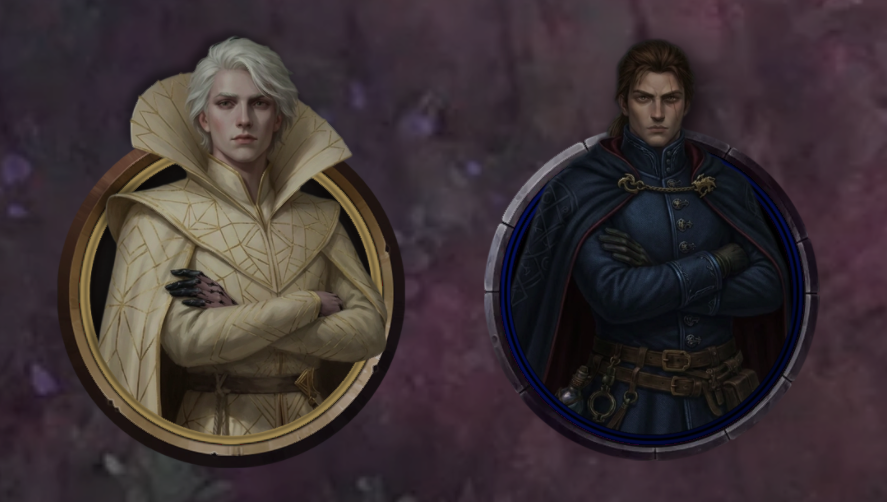
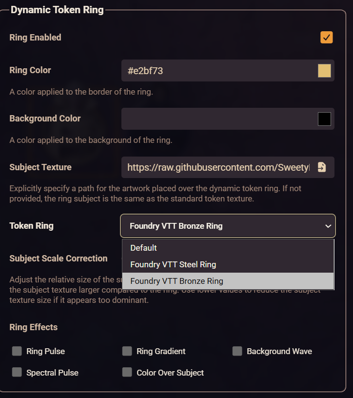

# Multiple Rings

**Different dynamic token rings for different tokens — for Foundry VTT v13+.**

Foundry allows only one dynamic ring style per world. This module removes that limit: every token can wear its own ring, chosen from all installed ring packs (core steel & bronze plus any added by other modules).

Requires [lib-wrapper](https://foundryvtt.com/packages/lib-wrapper).



---

## What you get

- A **ring selector** in the regular token settings (and prototype token settings).
- **Active Effects support** — give a boss a different ring in its second phase.
- **DAE-friendly** — the effect value is a dropdown of available rings, not a text field.
- **Smart memory use** — ring packs load only when actually used, unused packs are unloaded automatically, and render quality adapts to your device.
- **Safe by design** — if anything goes wrong (GPU limits, Foundry updates, missing modules), tokens simply fall back to the normal world-wide ring. Nothing crashes.

---

## Usage

### Token or actor

Open **Configure Token** (or **Configure Prototype Token** on an actor sheet) → *Appearance* tab → ring section → pick a pack from **Token Ring** → save.

Leave it on **Default** to follow the usual priority:

```
Active Effect → token → actor prototype → world setting
```



### Through an Active Effect

Add a change to any effect:

| | |
|---|---|
| Key | `flags.multiple-rings.ringAppearance` |
| Mode | Override |
| Value | pick a ring from the dropdown |

In DAE's editor the key is searchable by name and the value is a select. Empty value = default ring.

---

## Settings

| Setting | Scope | What it does |
|---|---|---|
| Multiple dynamic ring support | World | Master switch. Off = vanilla behavior. |

The quality budget itself is fully automatic — it needs no configuration.

### Quality budget

The atlas is one shared pixel budget, and it follows actual usage instead of preparing for every installed pack at once:

- Packs are planned and baked only when actually worn, plus the world default ring.
- Within a worn pack, only the **size variants** its tokens actually resolve to are baked
  (each sheet ships Tiny→Gargantuan variants; a Medium party needs 2 of a pack's 10 frames,
  so a ~75 MB sheet costs ~2 MB of atlas).
- Oversized frames are **density-capped**: a frame is never baked denser than ~512px per grid
  cell of the largest token wearing it, because the ring shader can only ever sample it at the
  token's on-screen size. Standard packs (512px/cell) are unaffected; single-variant 2048px
  sheets like Sweety Rings bake at 25% for a Medium party — 16× less atlas memory at identical
  on-screen quality. If a larger token arrives, the pack re-bakes higher automatically.
- Every pack starts at the best quality the scene can actually use.
- The atlas widens to your GPU's maximum texture size before anything is degraded — shrinking is the last resort, not the first. Tokens with the dynamic ring turned off cost nothing.
- When a newly worn ring doesn't fit, all packs step down the ladder together — 100 → 90 → 80 → … → 10% — just enough to make room, staying within one rung of each other.
- When eviction removes packs that are no longer worn, quality steps back up automatically and the atlas shrinks. Shrinking a token works the same way: the size variants and density it no longer needs are released on the next sweep.
- Degradation order within a pass: least recently used packs first. The world default ring joins the normal order but never drops below 50%.
- Each step is logged to the console and counted in `MultipleRings.status()`.

---

## Good to know

- **No FPS cost.** Rings render exactly like vanilla; everything happens when tokens are drawn, not every frame.
- **Seamless swaps.** Atlas rebuilds are atomic: a token keeps rendering its current ring while the new one bakes and switches straight to it — no flicker, no missing frames in between.
- **Memory and quality scale with usage.** Only packs actually worn by someone are loaded, and within them only the size variants their tokens use: unworn packs and unused variants cost nothing.
- **Packs unload immediately** once no placed token wears them — checked on scene loads, scene switches, token deletions and ring/effect changes — so experimenting never bloats memory. `MultipleRings.evictNow()` forces a sweep.
- **World setting stays untouched.** Tokens without a choice keep using it, and the module cleans up after itself if you ever turn it off.

---

## Troubleshooting

| Problem | Answer |
|---|---|
| Selector doesn't appear | Is lib-wrapper active? Is the module enabled? Check console lines starting with `multiple-rings \|`. |
| Token shows the default ring instead of my pick | That pack didn't fit into your GPU atlas even at the bottom of the quality ladder — wear fewer packs at once. `MultipleRings.status()` shows the fill and per-pack scales. |
| Rings look soft when zoomed way in | That pack was degraded by the quality budget to fit the atlas, or density-capped because no worn token is large enough to show more detail. Let unused packs get evicted, or check `scale`/`cap` in `MultipleRings.status()`. |

---

## For macros and developers

```js
// Read or set a token's ring
token.document.getFlag("multiple-rings", "ringAppearance");     // e.g. "coreBronze" or ""
await token.document.update({ "flags.multiple-rings.ringAppearance": "coreBronze" });
```

Any Active Effect change with the same key works the same way.

### Console diagnostics

The module exposes a small API via `game.modules.get("multiple-rings").api`, aliased as `window.MultipleRings` for quick typing in the console:

```js
MultipleRings.status();             // per-pack scales and density caps, atlas fill, GPU limits, degraded count
MultipleRings.packs();              // just the per-pack array from status()
await MultipleRings.retryFailed();  // re-bake packs that didn't fit, without a reload
MultipleRings.evictNow();           // force-unload packs no placed token wears
```

`status()` is the quickest way to see the budget at work: **layout** compares the planned height against what everything would need at full quality, and each pack row shows its current `scale`, starting `startScale`, its density `cap`, and which size `variants` are baked (`variantsAll` is how many the sheet ships).
